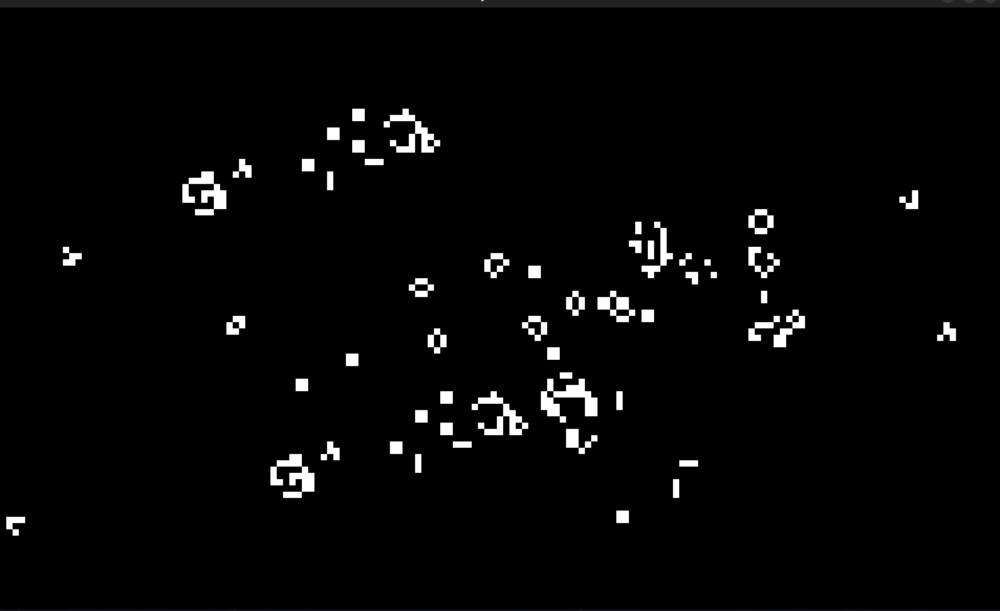

# Conways-Game-of-Life-in-Rust

## Description

This is Conway's Game of Life a cellular automata implemented in Rust using the Macroquad graphics library.

## Table of Contents

- [Installation](#installation)
- [Usage](#usage)
- [Features](#features)
- [Contributing](#contributing)
- [License](#license)
- [Contact](#contact)
- [Acknowledgments](#acknowledgments)

## Installation

1. Clone the repo

   ```sh
   git clone https://github.com/Ekansh38/Conways-Game-of-Life-in-Rust.git

   ```

2. Install Dependencies

   Have cargo and Rust correctly installed on your system

3. Run the project
   ```sh
   cd game-of-life/
   cargo run
   ```

## Usage

You can use this project to learn about the Game of Life and how it works.
You can also use this project to create your own patterns and see how they evolve over time.



## Contributing

I would love for anyone to contribute to this project and make it better in anyway possible. (because I am not that good at coding)

## License

Distributed under the MIT License. See LICENSE for more information.

## Contact

Ekansh - [Twitter or X](https://x.com/mister_byte_) - [YouTube Channel](https://www.youtube.com/@mister_byte_) - goenka.ekansh@gmail.com

## Acknowledgments

- [Macroquad](https://macroquad.rs/)
- [Wikipeida](https://en.wikipedia.org/wiki/Conway%27s_Game_of_Life)
